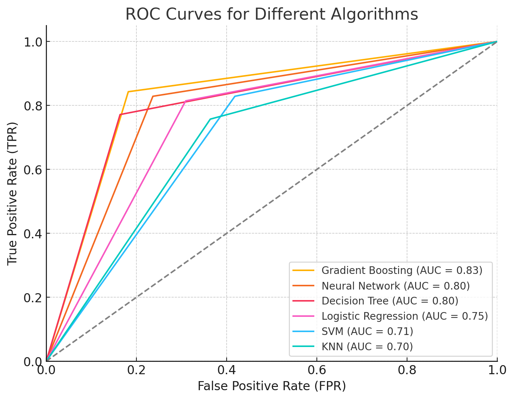

# *Listeria* in soil

🥬 This dataset contains the location, soil properties, climate, and land use for each soil sample tested for Listeria species. 

📖 This dataset is sourced from the publication "**Liao, J., Guo, X., Weller, D.L. et al. Nationwide genomic atlas of soil-dwelling Listeria reveals effects of selection and population ecology on pangenome evolution. Nat Microbiol 6, 1021–1030 (2021). https://doi.org/10.1038/s41564-021-00935-7**". 
Please cite this paper when using this dataset.

# Sample Analysis

## Overview

This project utilizes machine learning algorithms to analyze and predict Listeria contamination in food environments. Aimed at food safety researchers and public health officials, it provides a comprehensive toolkit for understanding patterns of Listeria outbreaks and formulating preventive measures. 
## Features
- **Dynamic Model Selection**: Choose from multiple algorithms including Logistic Regression, Neural Networks, Decision Trees, SVM, KNN, and Gradient Boosting.
- **Customizable Parameters**: Fine-tune model parameters such as regularization strength, number of epochs, and learning rate via command-line arguments.
- **Comprehensive Evaluation**: Outputs key performance metrics including accuracy, precision, recall, F1 score, and confusion matrix.
- **Data Standardization**: Automatically standardizes features to improve model performance.
- **Command Line Interface**: Execute the script and specify parameters directly from the command line for flexible model training and evaluation.
## Installation
## Dependencies
This project is built using Python and relies on several libraries for data processing and machine learning:  
1.Pandas  
2.Numpy  
3.Scikit-learn  
4.Keras  
5.TensorFlow

To get started with this project, follow these steps:

1. Install the required Python packages:
```bash
pip install -r requirements.txt
```
2. Clone the repository:

```bash
git clone https://github.com/FoodDatasets/ListeriaFoodEnvironment.git
cd ListeriaFoodEnvironment
```

## Supported Algorithms
1. logistic_regression: Logistic Regression
2. neural_network: Neural Network
3. decision_tree: Decision Tree
4. svm: Support Vector Machine
5. knn: K-Nearest Neighbors
6. gbm: Gradient Boosting Machine

## Machine Learning Model Execution Guide

This script allows users to select different machine learning algorithms via command line parameters to train models and evaluate them on a specified dataset.


### Required Arguments
- `--file_path` (required): The path to your CSV file.
- `--algorithm` (required): The algorithm to use. Options include `logistic_regression`, `neural_network`, `decision_tree`, `svm`, `knn`, `gbm`.

### Optional Arguments
- `--test_size`: The proportion of the dataset to include in the test split (default: 0.2).
- `--random_state`: The seed used by the random number generator (default: 42).
  
##### For the Neural Network algorithm, you can also specify:
- `--nn_epochs`: The number of epochs for training (default: 100).
- `--nn_batch_size`: The batch size during training (default: 10).
- `--nn_layers`: The number of hidden layers (default: 2).
- `--nn_neurons`: The number of neurons per hidden layer (default: 64).
 
##### Logistic Regression Specific Arguments
- `--lr_C`: Inverse of regularization strength; must be a positive float. Smaller values specify stronger regularization (default: 1.0).
- `--lr_penalty`: Specifies the norm used in the penalization (default: 'l2').

##### Decision Tree Specific Arguments
- `--dt_max_depth`: The maximum depth of the tree. If None, then nodes are expanded until all leaves are pure or until all leaves contain less than min_samples_split samples (default: None).
- `--dt_min_samples_split`: The minimum number of samples required to split an internal node (default: 2).

##### SVM (Support Vector Machine) Specific Arguments
- `--svm_C`: Regularization parameter. The strength of the regularization is inversely proportional to C. Must be strictly positive (default: 1.0).
- `--svm_kernel`: Specifies the kernel type to be used in the algorithm (default: 'rbf').

##### KNN (K-Nearest Neighbors) Specific Arguments
- `--knn_n_neighbors`: Number of neighbors to use for kneighbors queries (default: 5).
- `--knn_metric`: The distance metric to use for the tree (default: 'minkowski').

##### GBM (Gradient Boosting Machine) Specific Arguments
- `--gbm_learning_rate`: Learning rate shrinks the contribution of each tree by learning_rate. There is a trade-off between learning_rate and n_estimators (default: 0.1).
- `--gbm_n_estimators`: The number of boosting stages to be run (default: 100).

Additional optional arguments are available for other algorithms. Refer to the script's help for more details:
```bash
python ml_algorithms_runner.py --help
```
### Usage Example

To run a Neural Network algorithm on data.csv with 3 hidden layers, each with 32 neurons, for 50 epochs and a batch size of 16:
```bash
python ml_algorithms_runner.py --file_path data.csv --algorithm neural_network --nn_epochs 50 --nn_batch_size 16 --nn_layers 3 --nn_neurons 32
```

To run a Logistic Regression on your_data.csv with a regularization strength of 0.5 and using L1 penalty:
```bash
python ml_algorithms_runner.py --file_path your_data.csv --algorithm logistic_regression --lr_C 0.5 --lr_penalty l1

```
Adjust the above commands according to your actual file paths and parameters.

# Performance of Various Models on the Dataset

| Algorithm                      | Accuracy | Precision | Recall  | F1 Score |
| -------------------------------|----------|-----------|---------|----------|
| Gradient Boosting Classifier    | 0.83     | 0.86      | 0.84    | 0.85     |
| Neural Network                  | 0.80     | 0.82      | 0.83    | 0.82     |
| Decision Tree                   | 0.80     | 0.86      | 0.77    | 0.81     |
| Logistic Regression             | 0.76     | 0.77      | 0.81    | 0.79     |
| SVM (Support Vector Machine)    | 0.72     | 0.72      | 0.83    | 0.77     |
| KNN (k-Nearest Neighbors)       | 0.70     | 0.73      | 0.76    | 0.74     |


# Confusion Matrix Results for Various ML Algorithms

The following table details the confusion matrix results for each machine learning algorithm tested. These results provide insights into each model's ability to correctly predict the true positives and true negatives, as well as the instances of false positives and false negatives.

| Algorithm                      | True Negatives | False Positives | False Negatives | True Positives |
| -------------------------------|----------------|-----------------|-----------------|----------------|
| Gradient Boosting Classifier    | 45             | 10              | 11              | 59             |
| Neural Network                  | 42             | 13              | 12              | 58             |
| Decision Tree                   | 46             | 9               | 16              | 54             |
| Logistic Regression             | 38             | 17              | 13              | 57             |
| SVM (Support Vector Machine)    | 32             | 23              | 12              | 58             |
| KNN (k-Nearest Neighbors)       | 35             | 20              | 17              | 53             |

*Note: These results are indicative of the model's performance on the dataset, reflecting the balance between sensitivity (recall) and specificity.*




# LazyPredict Method
## Dependencies

- Python 3.6 or higher
- Required Python packages (can be installed using `pip`):
``` bash
pip install pandas scikit-learn matplotlib lazypredict
```

## Usage
``` bash
python LazyListeriaSoil.py --file_path /path/to/your csv --test_size 0.2 --random_state 42
```
### Command-line Arguments
- `--file_path`: Path to the CSV file containing the dataset (required).
- `--test_size`: Fraction of the dataset to be used as the test set (default is 0.2).
- `--random_state`: Random seed for reproducibility (default is 42).

## Example Output
### Model Performance Table

| Model                          | Accuracy | Balanced Accuracy | F1 Score | Time Taken | Sensitivity | Specificity |
|--------------------------------|----------|-------------------|----------|------------|-------------|-------------|
| LGBMClassifier                 | 0.67     | 0.27              | 0.65     | 0.41       | 0.32        | 0.91        |
| RandomForestClassifier         | 0.67     | 0.26              | 0.65     | 0.14       | 0.31        | 0.90        |
| ExtraTreesClassifier           | 0.65     | 0.25              | 0.64     | 0.07       | 0.34        | 0.90        |
| BaggingClassifier              | 0.65     | 0.25              | 0.62     | 0.06       | 0.30        | 0.91        |
| CalibratedClassifierCV         | 0.59     | 0.20              | 0.52     | 0.06       | 0.22        | 0.87        |
| SVC                            | 0.59     | 0.22              | 0.56     | 0.01       | 0.26        | 0.88        |
| DecisionTreeClassifier         | 0.58     | 0.24              | 0.59     | 0.01       | 0.28        | 0.93        |
| LinearSVC                      | 0.58     | 0.23              | 0.56     | 0.06       | 0.24        | 0.87        |
| LinearDiscriminantAnalysis     | 0.58     | 0.26              | 0.56     | 0.01       | 0.23        | 0.90        |
| KNeighborsClassifier           | 0.57     | 0.21              | 0.55     | 0.16       | 0.27        | 0.88        |
| LogisticRegression             | 0.56     | 0.24              | 0.55     | 0.01       | 0.23        | 0.87        |
| RidgeClassifier                | 0.55     | 0.21              | 0.52     | 0.01       | 0.24        | 0.87        |
| ExtraTreeClassifier            | 0.55     | 0.21              | 0.55     | 0.01       | 0.22        | 0.90        |
| QuadraticDiscriminantAnalysis  | 0.55     | 0.23              | 0.53     | 0.01       | 0.29        | 0.89        |
| RidgeClassifierCV              | 0.55     | 0.20              | 0.51     | 0.01       | 0.24        | 0.87        |
| LabelSpreading                 | 0.53     | 0.24              | 0.55     | 0.03       | 0.27        | 0.92        |
| LabelPropagation               | 0.53     | 0.24              | 0.55     | 0.03       | 0.27        | 0.92        |
| SGDClassifier                  | 0.51     | 0.20              | 0.51     | 0.01       | 0.19        | 0.88        |
| DummyClassifier                | 0.51     | 0.14              | 0.35     | 0.01       | 0.17        | 0.83        |
| BernoulliNB                    | 0.50     | 0.24              | 0.52     | 0.01       | 0.26        | 0.87        |
| AdaBoostClassifier             | 0.50     | 0.14              | 0.37     | 0.10       | 0.19        | 0.85        |
| Perceptron                     | 0.49     | 0.25              | 0.50     | 0.01       | 0.19        | 0.88        |
| PassiveAggressiveClassifier    | 0.47     | 0.20              | 0.49     | 0.01       | 0.23        | 0.89        |
| NearestCentroid                | 0.29     | 0.15              | 0.37     | 0.10       | 0.19        | 0.88        |
| GaussianNB                     | 0.27     | 0.17              | 0.30     | 0.01       | 0.18        | 0.88        |


### Model Accuracy Comparison


### Model Comparison

